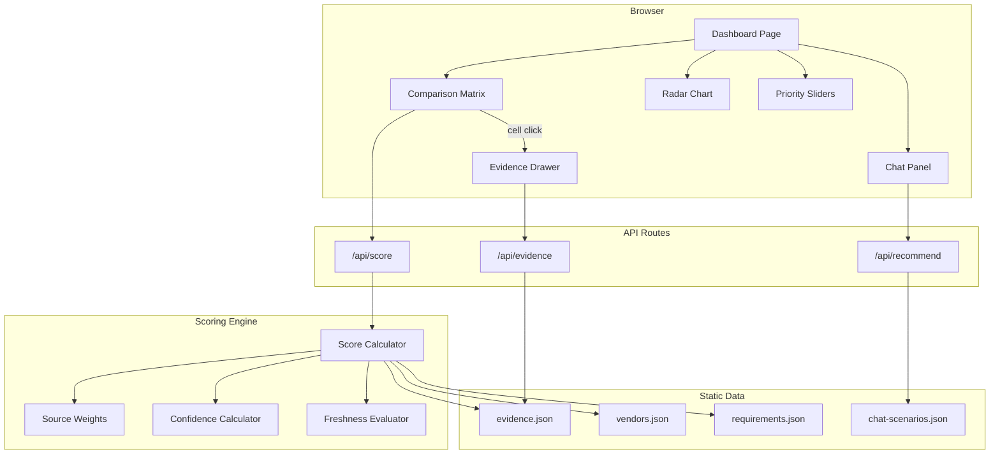

# SignalCore

A vendor research and evaluation tool for comparing LLM observability platforms. SignalCore helps teams make data-driven decisions when choosing between LangSmith, Langfuse, and Braintrust by aggregating evidence, scoring vendors against requirements, and providing personalized recommendations.

## Quick Start

```bash
pnpm install
pnpm dev
```

Open [http://localhost:3000](http://localhost:3000) to view the dashboard.

**Live Demo**: [signalcore-assignment.vercel.app](https://signalcore-assignment.vercel.app/)

## Architecture



## Scoring Methodology

SignalCore uses a deterministic, evidence-based scoring system:

1. **Evidence Collection**: Each vendor-requirement pair is backed by curated evidence items sourced from official docs, GitHub repos, blog posts, and community discussions.

2. **Source Weighting**: Evidence is weighted by source reliability:
   - Official Docs: 1.0
   - GitHub: 0.8
   - Blog Posts: 0.6
   - Community: 0.4

3. **Recency Multiplier**: Newer evidence counts more:
   - Fresh (< 90 days): 1.0
   - Aging (90-365 days): 0.85
   - Stale (> 365 days): 0.7

4. **Confidence Levels**: Determined by evidence quantity, recency, and source diversity:
   - **High**: 3+ strong official sources
   - **Medium**: Mixed sources
   - **Low**: < 2 items or all stale

5. **Priority Weighting**: Requirements are weighted by priority (High=3, Medium=2, Low=1), adjustable via interactive sliders.

## Tech Stack

- **Framework**: Next.js 16 (App Router)
- **Language**: TypeScript (strict mode)
- **Styling**: Tailwind CSS v4
- **Charts**: Recharts
- **Icons**: Lucide React
- **Testing**: Vitest + Testing Library (unit), Playwright (e2e)

## Project Structure

```
src/
├── app/              # Next.js App Router pages & API routes
├── components/       # React components organized by feature
│   ├── layout/       # Header, Sidebar, Footer
│   ├── matrix/       # Comparison grid, score cells, badges
│   ├── evidence/     # Evidence drawer and cards
│   ├── charts/       # Radar and bar charts
│   ├── chat/         # Chat panel, messages, recommendations
│   ├── vendors/      # Vendor score cards
│   └── settings/     # Priority sliders, export
├── lib/              # Business logic
│   ├── scoring/      # Scoring engine, weights, confidence
│   ├── chat/         # Chat scenarios and matching
│   └── utils/        # Freshness, export utilities
└── data/             # Static JSON data files
```

## Testing

```bash
# Unit + AI tests
pnpm test

# E2E tests
npx playwright test

# Coverage report
pnpm test -- --coverage
```

### Test Categories

- **Unit Tests**: Scoring engine, confidence calculation, weights, freshness
- **AI Tests**: Prompt regression, scoring consistency, hallucination detection, response quality
- **E2E Tests**: Dashboard rendering, evidence drawer, chat interactions

## AI Usage Log

This project was built with Claude Code as a pair-programming assistant. Claude was used for:

- Project scaffolding and architecture decisions
- Implementing the scoring engine and business logic
- Building React components and UI layout
- Writing test suites
- Researching vendor documentation for evidence data
- Code review via Codex MCP

## What I'd Build Next

- **Live LLM Integration**: Replace hardcoded chat with Claude API calls using the multi-model architecture (documented in code)
- **Evidence Auto-Refresh**: Periodic scraping of vendor docs/changelogs to keep evidence current
- **User Accounts**: Save custom priority weights and comparison sessions
- **More Vendors**: Expand beyond the initial 3 to include Weights & Biases, Helicone, etc.
- **Collaborative Evaluation**: Share comparisons with team members, add comments
- **PDF Export**: Generate formatted PDF reports alongside Markdown

## Screenshots

<!-- Screenshots will be added after UI is built -->

## License

MIT
