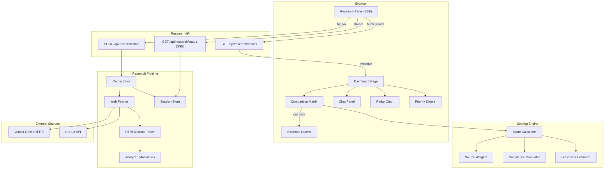

# SignalCore

A vendor research and evaluation tool for comparing LLM observability platforms. SignalCore **programmatically researches vendors** by fetching real public data from documentation sites and GitHub repos, then scores them against requirements using a deterministic scoring engine.

**Vendors evaluated**: LangSmith, Langfuse, Braintrust, PostHog

## Quick Start

```bash
pnpm install
cp .env.example .env.local  # optional — defaults to simulated mode
pnpm dev
```

Open [http://localhost:3000](http://localhost:3000) and click **"Run Research"** to trigger the agentic research pipeline.

**Live Demo**: [signalcore-assignment.vercel.app](https://signalcore-assignment.vercel.app/)

## How It Works

1. **Click "Run Research"** — the app starts fetching real vendor documentation pages and GitHub repos
2. **Real web scraping** — HTTP requests to vendor docs, GitHub API (repo metadata + READMEs)
3. **Evidence extraction** — an analysis layer processes fetched text and extracts structured evidence (simulated LLM in default mode, swappable to real Claude API)
4. **Scoring** — deterministic engine scores each vendor against each requirement based on evidence quality, source type, and recency
5. **Live progress** — SSE streams progress events to the UI in real-time (per-vendor status, source fetch progress, evidence counts)

## Architecture



## Research Pipeline

The agentic research workflow fetches real public data:

| Layer | What it does | Key file |
|-------|-------------|----------|
| **Sources** | 18 real URLs across 4 vendors (docs, GitHub API) | `src/lib/research/sources.ts` |
| **Fetcher** | HTTP client with 10s timeout, retries, caching | `src/lib/research/fetcher.ts` |
| **Parser** | HTML-to-text extraction, GitHub README/repo parsing | `src/lib/research/parser.ts` |
| **Analyzer** | Evidence extraction — mock (default) or live LLM | `src/lib/research/analyzer.ts` |
| **Orchestrator** | Sequential vendor processing, concurrent page fetching | `src/lib/research/orchestrator.ts` |
| **SSE** | Real-time progress streaming to browser | `src/app/api/research/status/route.ts` |

### Research Modes

Set via `RESEARCH_MODE` environment variable:

- **`simulated`** (default) — Real web fetching + pre-generated analysis responses. No API keys needed.
- **`live`** — Real web fetching + real LLM API calls for evidence extraction. Requires `ANTHROPIC_API_KEY`.

The prompts for live mode are documented in `src/lib/research/prompts.ts` for technical discussion.

## Scoring Methodology

Deterministic, evidence-based scoring:

1. **Evidence Collection**: Research pipeline fetches vendor docs and extracts claims
2. **Source Weighting**: official=1.0, github=0.8, blog=0.6, community=0.4
3. **Recency Multiplier**: fresh(<90d)=1.0, aging(90-365d)=0.85, stale(>365d)=0.7
4. **Confidence**: Based on evidence quality — official + fresh + strong = high confidence
5. **Priority Weighting**: High=3, Medium=2, Low=1 (adjustable via sliders)

## Tech Stack

- **Framework**: Next.js 16 (App Router)
- **Language**: TypeScript (strict mode)
- **Styling**: Tailwind CSS v4
- **Charts**: Recharts
- **Icons**: Lucide React
- **Animations**: Framer Motion
- **Toasts**: Sileo
- **Testing**: Vitest (unit/AI), Playwright (e2e)
- **CI/CD**: GitHub Actions + Vercel

## Project Structure

```
src/
├── app/                  # Next.js App Router pages & API routes
│   └── api/
│       ├── research/     # Research pipeline API (start, status, results)
│       ├── evidence/     # Evidence data endpoint
│       ├── recommend/    # Chat recommendation endpoint
│       └── score/        # Score calculation endpoint
├── components/           # React components by feature
│   ├── research/         # ResearchPanel, VendorProgress, EventLog
│   ├── matrix/           # ComparisonMatrix, ScoreCell, badges
│   ├── evidence/         # EvidenceDrawer, EvidenceCard
│   ├── charts/           # RadarChart, ScoreBarChart
│   ├── chat/             # ChatPanel, ChatMessage
│   ├── vendors/          # VendorScoreCard, VendorToggleChips
│   └── settings/         # PrioritySliders, ExportButton
├── lib/                  # Business logic (no React)
│   ├── research/         # Agentic research pipeline
│   │   ├── types.ts      # Research types (sessions, events, pages)
│   │   ├── sources.ts    # Vendor source URL configurations
│   │   ├── fetcher.ts    # HTTP fetcher with caching
│   │   ├── parser.ts     # HTML/GitHub response parsers
│   │   ├── analyzer.ts   # Evidence extraction (mock/live)
│   │   ├── orchestrator.ts # Pipeline coordinator
│   │   ├── prompts.ts    # LLM prompts for live mode
│   │   └── session-store.ts # In-memory session management
│   ├── scoring/          # Scoring engine, weights, confidence
│   ├── chat/             # Chat scenarios and matching
│   └── utils/            # Freshness, export utilities
└── data/                 # Vendor/requirement definitions
```

## Testing

```bash
pnpm test              # Unit + AI tests (115 tests)
npx playwright test    # E2E tests
pnpm test -- --coverage
```

### Test Results

**115 tests passing** across 10 test suites:

| Suite | Tests | Category |
|-------|-------|----------|
| `scoring.test.ts` | 10 | Unit — scoring engine, determinism, ranking |
| `confidence.test.ts` | 5 | Unit — confidence level calculation |
| `weights.test.ts` | 10 | Unit — source/strength/priority weights |
| `freshness.test.ts` | 6 | Unit — recency levels and multipliers |
| `parser.test.ts` | 31 | Unit — HTML/GitHub response parsing |
| `mock-analyzer.test.ts` | 33 | Unit — mock analyzer, 24-pair coverage |
| `prompt-regression.test.ts` | 5 | AI — scenario matching accuracy |
| `scoring-consistency.test.ts` | 5 | AI — deterministic scoring guarantees |
| `hallucination-detection.test.ts` | 5 | AI — no fabricated vendors/claims |
| `response-quality.test.ts` | 5 | AI — response length, trade-offs, structure |

## Design & Planning

- **Plan in Claude**: [claude.ai/share/2447e604](https://claude.ai/share/2447e604-0a92-4bf5-822e-ae4832b47a2b)
- **Design in Stitch**: [stitch.withgoogle.com/projects/13656588671312878511](https://stitch.withgoogle.com/projects/13656588671312878511)

## AI Usage Log

This project was built with Claude Code as a pair-programming assistant. Claude was used for:

- Project scaffolding and architecture decisions
- Implementing the scoring engine and business logic
- Building React components and UI layout
- Writing test suites (115 tests across 10 suites)
- Designing the agentic research pipeline architecture
- Generating mock LLM responses with realistic vendor data
- Code review via Codex MCP (OpenAI) and Gemini for plan validation

## What I'd Build Next

- **Live LLM Integration**: Swap mock analyzer for real Claude API calls (prompts already documented in `prompts.ts`)
- **Persistent Sessions**: Replace in-memory session store with Redis/SQLite for multi-instance deployments
- **Evidence Auto-Refresh**: Scheduled re-research with diff detection for stale evidence
- **More Vendors**: Expand to Weights & Biases, Helicone, Arize, etc.
- **Collaborative Evaluation**: User accounts, shared sessions, team annotations
- **PDF Export**: Generate formatted PDF reports alongside Markdown

## Features

- **Agentic Research** — real web scraping of vendor docs and GitHub repos with live SSE progress
- **Comparison Matrix** — 6 requirements x 4 vendors with clickable score cells
- **Evidence Drawer** — slide-out panel with source provenance, freshness indicators, strength ratings
- **Radar Chart** — visual comparison across all evaluation criteria
- **Chat Panel** — AI-powered vendor advisor with predefined scenarios and keyword matching
- **Priority Sliders** — adjust requirement weights (1-5) with live score recalculation
- **Vendor Toggle** — hide/show vendors with smooth animations
- **Export** — copy report to clipboard or download as Markdown
- **Dark Mode** — fully dark-themed UI with oklch color palette

## License

MIT
