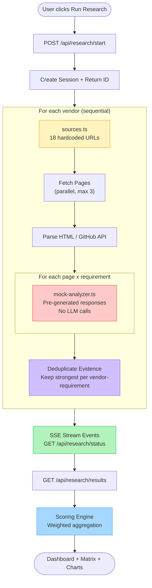
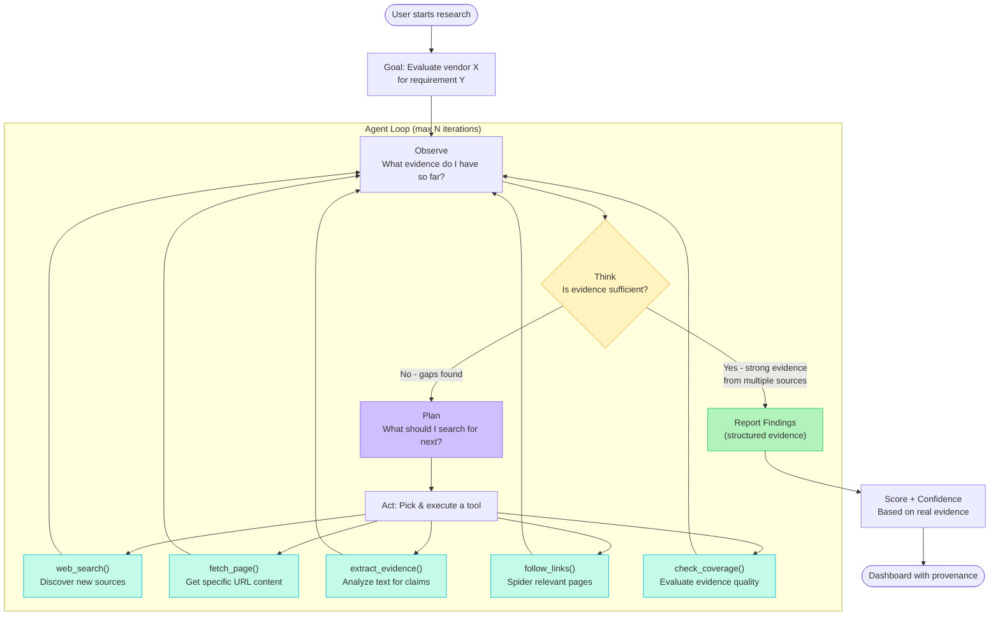
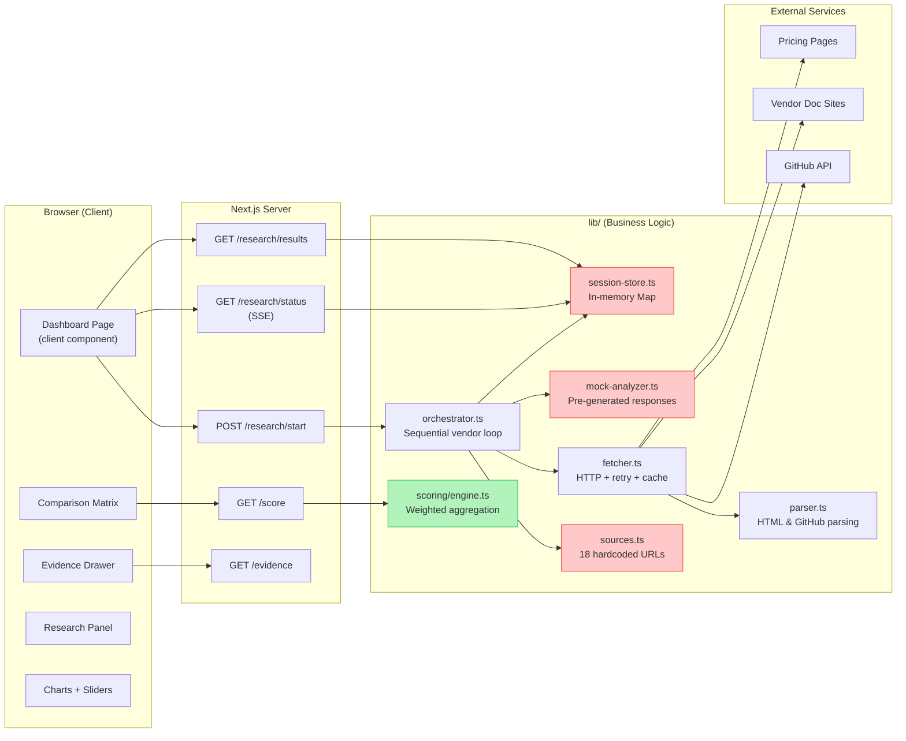
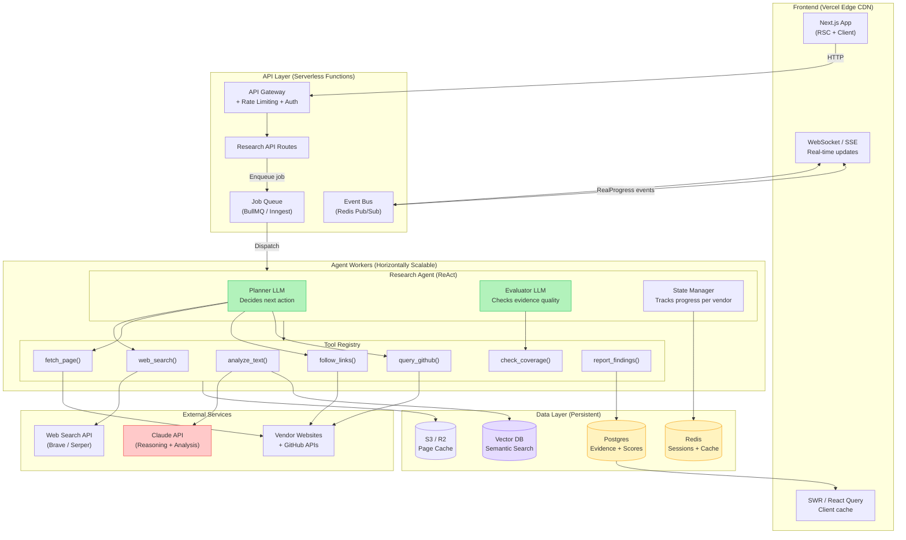

# SignalCore Architecture Diagrams

## 1. Current Workflow: Fixed Pipeline

**Limitations:**
- No dynamic source discovery — always the same 18 URLs
- No reasoning — if evidence is weak, pipeline moves on
- No adaptability — same path every run regardless of results
- Mock analyzer returns deterministic, pre-written responses

---

## 2. Agentic Approach: ReAct Loop

**Key differences from current:**
- Agent **decides** what to search — no hardcoded URL list
- Agent **evaluates** evidence quality and decides when to stop
- Agent **adapts** strategy based on what it finds (or doesn't find)
- Agent can **follow links** and discover sources we never predicted
- Each iteration streams progress events to the UI in real-time

---

## 3. Current Architecture

**Pain points (in red):**
- `SessionStore` — in-memory Map, lost on restart, can't scale horizontally
- `Sources` — hardcoded URLs, no dynamic discovery
- `MockAnalyzer` — no real analysis, deterministic lookup

---

## 4. Production Architecture (Scalable + Agentic)

**How it scales:**
- **Agent Workers** scale horizontally — add more instances behind the job queue
- **Job Queue** (BullMQ/Inngest) distributes vendor research jobs across workers
- **Redis Pub/Sub** fans out real-time events to all connected clients
- **Vector DB** enables semantic search across previously cached evidence (no re-fetching)
- **S3/R2 page cache** avoids re-fetching vendor docs across research sessions
- **Postgres** stores evidence permanently for cross-session analysis
- **Serverless API** auto-scales with traffic, no server management
